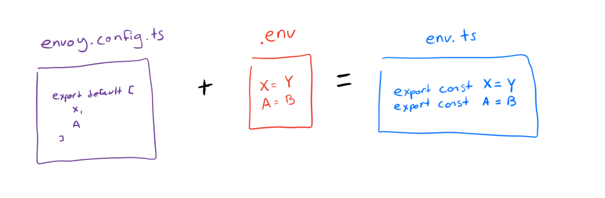
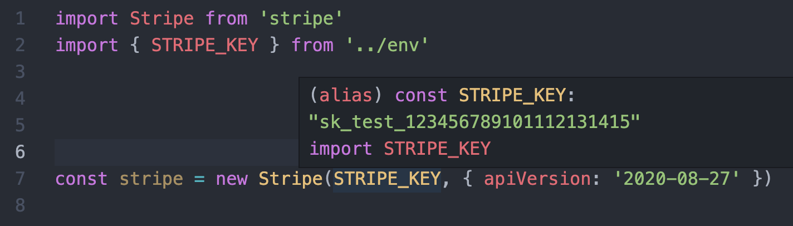

# 🚛 Envoy



Envoy gives your TypeScript apps type safe access to environment variables.

Envoy accepts an `envoy.config.ts` file and an `.env` file as input and generates a single `env.ts` file which exports a constant for each variable as output.



There are a few major benefits to this approach:

1. You no longer need to keep track of what environment variables + secrets your app needs to run. Your `envoy.config.ts` defines them all.
2. By adding a `envoy` step before starting your app, you can prevent it from starting/deploying unless all required environment variables are present.
3. Because envoy generates a `.ts` env file, you get _full editor support_ and static type checking. Mistyping a variable name will result in a compile time error, not a mysterious runtime bug.

## Getting Started

1. **Install Envoy**

Using yarn:

```
yarn add @interval/envoy
```

2. **Create your config + .env files**

You'll next need to create an Envoy config file. This defines the variables that Envoy will expect.

**⚙️ envoy.config.ts**

```ts
import { EnvoyVariableSpec } from '@interval/envoy'

const vars: EnvoyVariableSpec[] = ['DATABASE_URL', 'STRIPE_API_KEY']

export default vars
```

Commit this to your repo!

**🔐 .env**

This is a standard .env file in `KEY=VALUE` format. Each key in this file should correspond to what you've defined in `envoy.config.ts`.

The values in this file are either secrets which you _can't_ commit or environment specific configuration details which you _shouldn't_.

```sh
DATABASE_URL=postgres://root@db.com:5432
STRIPE_API_KEY=sk_test_123456789101112131415
```

**Don't commit this file!**

3. Run envoy!

Running `yarn envoy` will look for a `.env` and `envoy.config.ts` file in your current working directory and will output an `env.ts` file that looks like this:

```ts
// THIS FILE WAS AUTOMATICALLY GENERATED BY ENVOY
// TO ADD A NEW ENVIRONMENT VARIABLE, RUN ENVOY
// DO NOT EDIT THIS FILE DIRECTLY

const DATABASE_URL = 'postgres://root@db.com:5432'
const STRIPE_KEY = 'sk_test_123456789101112131415'

export { STRIPE_KEY, DATABASE_URL }
```

You can use this like any other TypeScript file. Just be sure that you **don't commit this file** as it contains your secrets that you defined manually in your `.env` file.

## Behavior

If you define a variable in `.env` but exclude it from your `envoy.config.ts`, the resulting `env.ts` file _will not_ contain that variable.

If you define a variable in `envoy.config.ts`, but don't define it in your `.env`, Envoy will fail and will exit with code 1.

## Recommended usage

We suggest you run `yarn envoy` each time your app compiles. For example, at [Interval](https://interval.com), our yarn `start:dev` command runs `yarn envoy && yarn ts:node`.

Note that this library effectively hard codes your secrets into each build. Depending on your infrastructure, this may be a non-starter.
